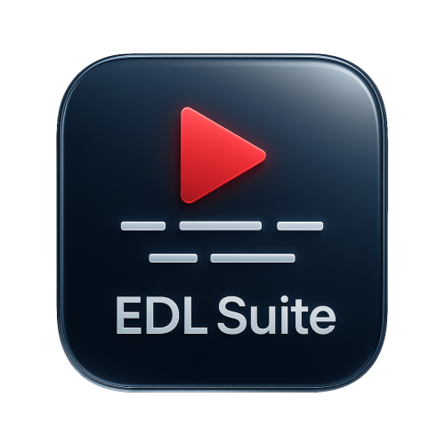
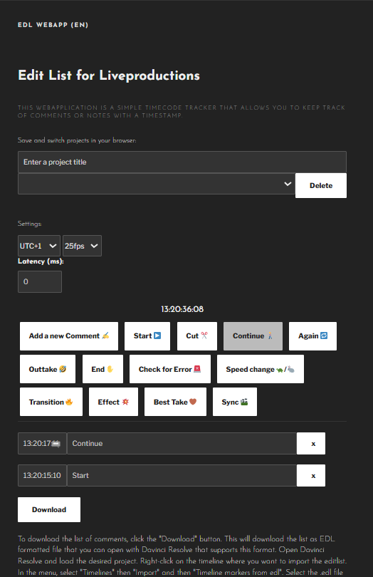
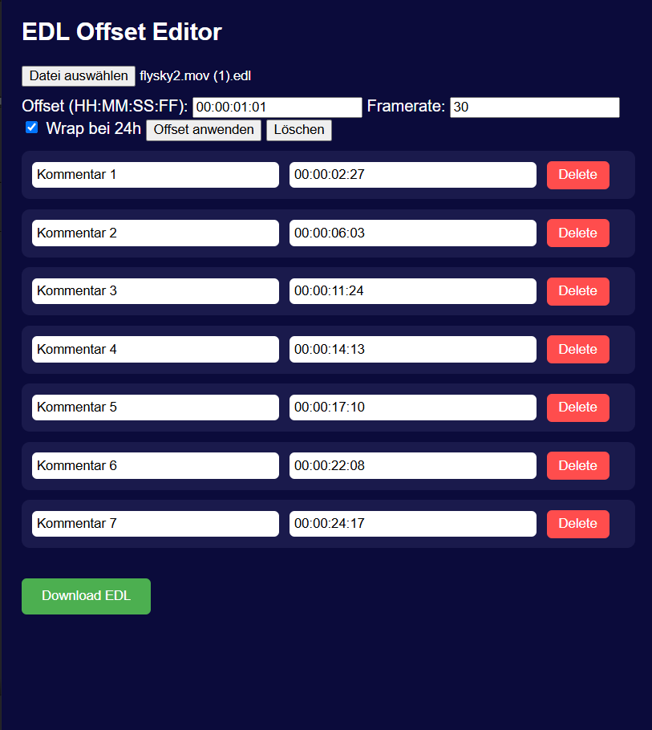

# 🎬 EDL Tools for ATEM Live Video Production & DaVinci Resolve


<p>
  
This repository provides two lightweight, browser-based web applications to support timecode-based editing and video annotation workflows, particularly for live productions and DaVinci Resolve postproduction.
</p>

<br>

[](https://phantomcrew-de.github.io/EDL-Tools-for-Live-Video-Production/EDL_Tabs.html)


---

## 🛠️ Tools Included

### 1. **EDL Marker Tool for Live Production**
[Example: EDL Marker Tool](https://phantomcrew-de.github.io/EDL-Tools-for-Live-Video-Production/EDL_Tabs.html#atem?lang=en)
File: `EDL_for_ATEM_live_production_1_1_EN.html`

A browser-based timecode tracker tailored for live production environments (e.g., ATEM-based multicam shoots). It enables editors or live directors to mark important moments (Start, Cut, Outtake, etc.) with frame-accurate timestamps and generate `.EDL` files for import into DaVinci Resolve.

#### 📷 Screenshot
<table>
  <tr>
    <td align="center" width="50%">
      <br>
      <strong>EDL Marker Tool</strong>
    </td>
  </tr>
</table>

#### ✨ Features

* Real-time timecode with configurable framerate (24–120 fps)
* Timezone and latency correction
* Marker buttons with common live production tags
* Editable project list saved locally via cookies
* Export EDL files compatible with Resolve ("Timeline Markers from EDL")

---

### 2. **EDL-Enabled Video Commenting Tool for Resolve**
[Example: EDL Video Player](https://phantomcrew-de.github.io/EDL-Tools-for-Live-Video-Production/EDL_Tabs.html#resolve)
File: `EDL_video_player_for_resolve_1_1_EN.html`

An HTML video player for reviewing media files and adding comments directly at specific timecodes. Designed for editors and directors to review takes collaboratively.

#### 📷 Screenshot
<table>
  <tr>
    <td align="center" width="50%">
      <br>
      <strong>EDL Video Player</strong>
    </td>
  </tr>
</table>

#### ✨ Features

* Import multiple local video files
* Add, edit, and delete time-stamped comments
* Import and parse `.EDL` files generated from the marker tool
* Export annotated `.EDL` files with Resolve-compatible metadata

---

## 🧩 Use Cases

* Live event direction (e.g., theater, conferences)
* Syncing postproduction notes with video material
* Collaborative feedback on rough cuts
* Nonlinear editing workflows in Resolve

---

### 3. **EDL Offset Editor**

[Example: EDL Offset Editor](https://phantomcrew-de.github.io/EDL-Tools-for-Live-Video-Production/EDL_Tabs.html#offset)
File: `EDL_Offset_Editor_1_1_EN.html`

#### 📷 Screenshot
<table>
  <tr>
    <td align="center" width="50%">
      <br>
      <strong>EDL Offset Editor</strong>
    </td>
  </tr>
</table>


---

## 📝 How to Use

1. Open either HTML file in your browser.
2. Use the interface to mark or annotate moments.
3. Export the EDL file.
4. In **DaVinci Resolve**:

   * Right-click on a timeline → `Timelines` → `Import` → `Timeline Markers from EDL`.

---

## 📦 Requirements

* A modern web browser (Chrome, Firefox, Edge, etc.)
* Local video files for the player
* No server required – everything runs client-side

---

## 📁 File Structure

```
📁 EDL-Tools-for-Live-Video-Production-main
├── 📄 EDL_for_ATEM_live_production_1_1_EN.html
├── 📄 EDL_for_ATEM_live_production_1_1_DE.html
├── 📄 EDL_video_player_for_resolve_1_1_DE.html
├── 📄 EDL_Offset_Editor_1_1_EN.html
├── 📄 LICENSE
├── 📄 README.md
├── 📁 css
│   └── 📄 style.css
├── 📁 legacy
│   ├── 📄 EDL_for_ATEM_live_production_0_1_EN.html
│   └── 📄 style.css
└── 📁 sfx
    └── 🔊 beepsound.mp3
```


**Changelog 1.1 → 2.0 (EDL Review Player Update)**

* 💡 **Full redesign:** modern dark UI, responsive layout, cleaner code structure.
* 🌍 **Bilingual UI:** English / German with live toggle.
* 🎥 **YouTube support:** videos, playlists, lives, shorts — automatic title fetching.
* 📁 **Local files:** multi-file upload, unified source selector.
* 💬 **Comments:** editable text/timecode, Go To & Delete buttons, auto-pause while typing.
* 🗂️ **EDL:** improved import/export, sanitized filenames, correct timecode formatting.
* ⚠️ **File-mode warning:** shows tips for `file://` usage and YouTube API.
* ⚙️ **Internals:** async YouTube resolver, title cache, better timecode functions.

> v2.0 = multilingual, YouTube-ready, all-in-one EDL review player with a streamlined workflow.


---

## 📄 License
Licensed under the GNU General Public License v3.0 (GPL-3.0) — free to use, modify, and distribute under the same terms.
This is an unofficial project and has no affiliation with Blackmagic Design.
“DaVinci Resolve” is a registered trademark of Blackmagic Design Pty Ltd.

---

## 🤝 Author

Made with ❤️ by Julius – [phantomcrew.de](https://phantomcrew.de/)
